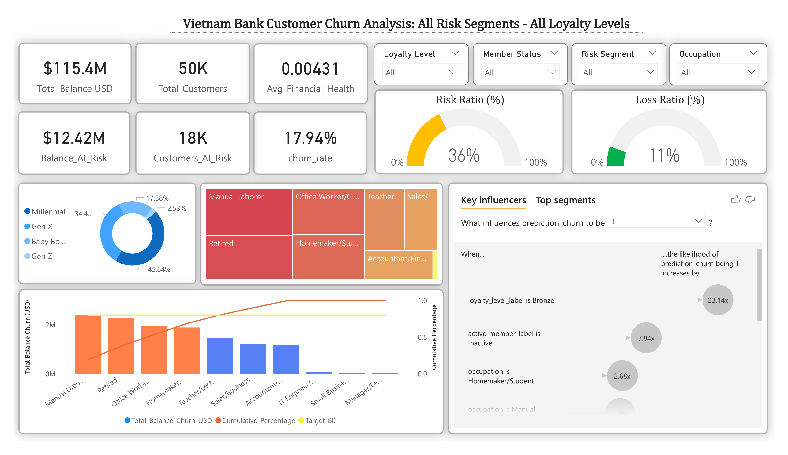
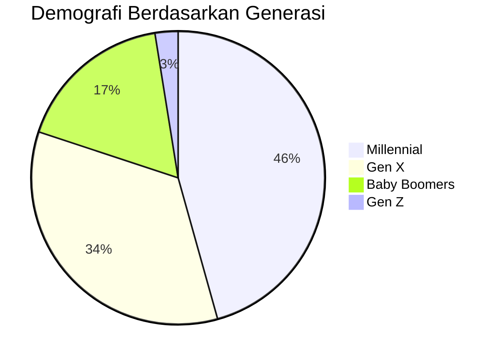
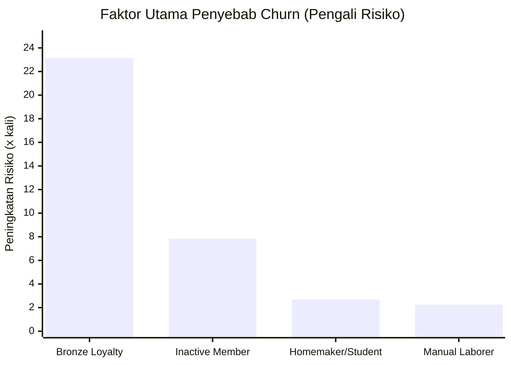

# Interpretasi Dashboard: Vietnam Bank Customer Churn Analysis

Laporan ini berisi interpretasi dari hasil visualisasi data pada file `Dashboard.pdf` yang berfokus pada analisis *churn* (berhentinya nasabah) pada bank di Vietnam.

## 1. Ringkasan Eksekutif (Key Performance Indicators)

Berikut adalah metrik utama dari performa keseluruhan nasabah:

| Indikator Kinerja Utama (KPI) | Nilai | Deskripsi |
| :--- | :--- | :--- |
| **Total Customers** | **50K** | Total nasabah terdaftar (50.000 pelanggan) |
| **Total Balance USD** | **$115.4M** | Total saldo keseluruhan nasabah |
| **Avg_Financial_Health** | **0.00431** | Rata-rata kesehatan finansial nasabah |
| **Churn Rate** | **17.94%** | Persentase pelanggan yang telah/diprediksi akan *churn* |
| **Customers_At_Risk** | **18K** | Jumlah nasabah yang memiliki risiko untuk *churn* |
| **Balance_At_Risk** | **$12.42M** | Total saldo nasabah yang berisiko ditarik/hilang ($12.42 Juta) |

### Rasio Risiko Bank (Gauge Charts)
- **Risk Ratio:** **36%** (36% dari keseluruhan nasabah berada dalam kategori berisiko).
- **Loss Ratio:** **11%** (Bank berpotensi kehilangan sekitar 11% dari total nilai saldo akibat *churn*).

---

## 2. Profil Demografi Nasabah (Generasi)

Demografi nasabah didominasi oleh **Millennial (45,64%)** dan disusul oleh **Gen X (34,4%)**.

---

## 3. Profil Demografi Pekerjaan (Treemap)

Sebagian besar nasabah berasal dari profesi:
1. **Manual Laborer** (Pekerja Kasar) - *Porsi Terbesar*
2. **Retired** (Pensiunan)
3. **Office Worker / Civil Servant** (Pekerja Kantoran / PNS)
4. **Homemaker / Student** (Ibu Rumah Tangga / Pelajar)
5. **Teacher / Lecturer** (Guru / Dosen)
6. **Sales / Business**
7. **Accountant / Finance**

---

## 4. Faktor Utama Penyebab Churn (Key Influencers)

Sistem menemukan faktor-faktor yang paling memengaruhi nasabah untuk melakukan *churn* (menaikkan kemungkinan predikasi *churn* menjadi 1):

| Faktor (Kondisi) | Peningkatan Risiko Churn |
| :--- | :--- |
| **Loyalty level is Bronze** | **23.14x** lebih tinggi |
| **Active member label is Inactive** | **7.84x** lebih tinggi |
| **Occupation is Homemaker/Student** | **2.68x** lebih tinggi |
| **Occupation is Manual Laborer** | **2.25x** lebih tinggi |

---

## 5. Analisis Pareto: Total Balance Churn Berdasarkan Pekerjaan

Grafik Pareto (Total Balance Churn USD dan Cumulative Percentage hingga Target 80%) menganalisis pekerjaan mana yang paling berdampak besar terhadap kehilangan saldo:

**Urutan Profesi Penyumbang Balance Churn Terbesar:**
1. Manual Laborer
2. Retired
3. Office Worker
4. Homemaker
5. Teacher / Lecturer
6. Sales / Business
7. Accountant / Finance
8. IT Engineer
9. Small Business
10. Manager / Leader

*Catatan: Segmen pekerja nomor 1 hingga 4 (Manual Laborer hingga Homemaker) adalah penyumbang dominan nilai "Balance At Risk" ($12.42M) dan harus menjadi prioritas retensi.*

---

## 6. Kesimpulan dan Rekomendasi Bisnis

* **Taktik Retensi pada Nasabah Inaktif & Perunggu (Bronze):** Status inaktif adalah penyebab besar *churn* (7.84x risiko). Bank perlu meluncurkan *campaign* aktivasi ulang yang mendesak nasabah Inaktif agar kembali bertransaksi, serta mendorong pelanggan level Bronze (23.14x risiko) agar naik ke tingkat Silver/Gold.
* **Fokus Layanan pada Profil Rentan:** Pekerja Kasar (*Manual Laborer*) dan Pensiunan (*Retired*) menempati posisi puncak penyumbang nilai penarikan (Pareto) sekaligus lebih berisiko *churn*. Pendekatan pelayanan atau promo khusus untuk profil ini sangat dianjurkan guna menyelamatkan Total Saldo Berisiko.
